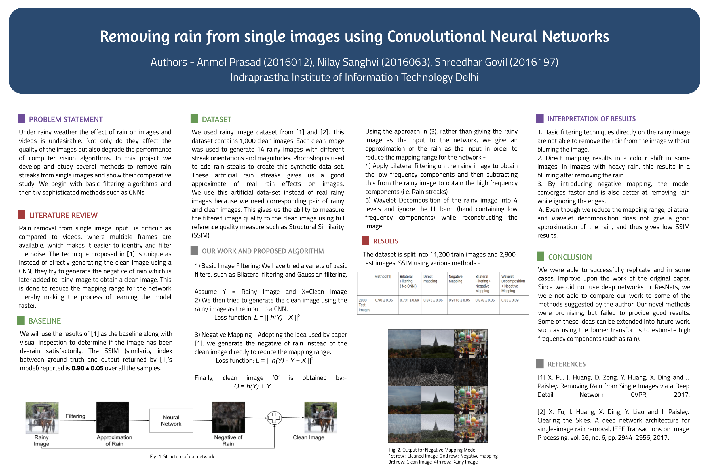

# RainRemover  

Under rainy weather the effect of rain on images and videos is undesirable. Not only do they affect the quality of the images but also degrade the performance of computer vision algorithms. In this project we develop and study several methods to remove rain streaks from single images and show their comparative study. We begin with basic filtering algorithms and then try sophisticated methods such as CNNs.

| Network | Negative residual filtering |
| :---: | :----: |
|  |  |

## Poster

## Running the code

Download the rainy-image-dataset  
Split into train and test sets such that there is not overlap between images in train and test  
For example move randomly 200 images from ground truth to testing's ground truth and the corresponding 14 rainy images of those 200 from rainy images to testing's rainy images.  

The file structure looks like this:  
rainy-image-dataset/  
 * testing/  
   * /ground truth Containing first 200 images  
   * /rainy images Contains the corresponding images to the first 200 images total size 200*14  
 * training/  
   * /ground truth  
   * /rainy images  
   
 `python conv_auto.py` to run the script.
   
 
 
